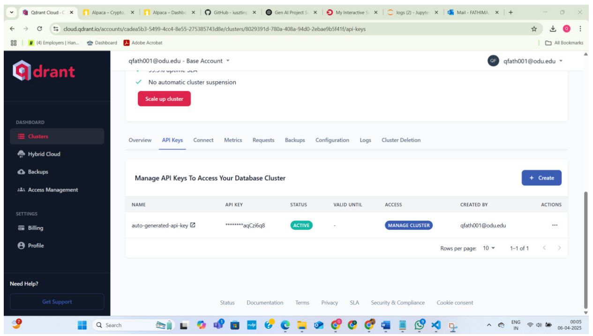
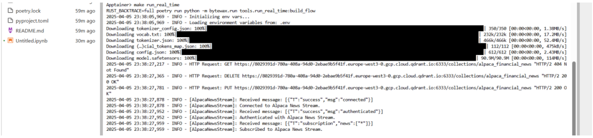
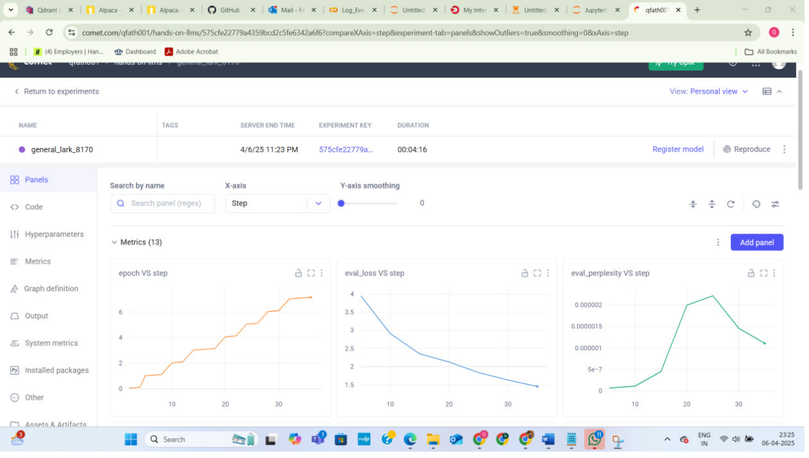
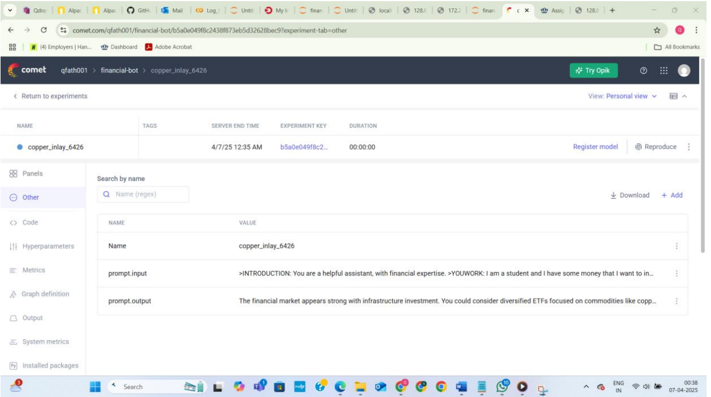

# Financial News Bot with LLMs

A real-time financial assistant that integrates **Qdrant vector database** with the **Alpaca News API**, and uses a **streaming pipeline** to retrieve news and generate responses with **Large Language Models (LLMs)**. Experiment tracking and monitoring are handled through **Comet ML**.  

This project demonstrates skills in **LLMs, vector databases, MLOps pipelines, and cloud integration** - building end-to-end systems ready for scalable deployment.

---

##  Features
- Real-time ingestion of financial news using **Alpaca News API**
- Storage and retrieval of embeddings with **Qdrant Vector Database**
- Response generation using **LLM-based pipelines**
- Experiment logging and monitoring with **Comet ML**
- Modular pipeline design (streaming, training, financial bot)

---

##  Tech Stack
- **Programming:** Python, Poetry  
- **Databases:** Qdrant (Vector DB)  
- **APIs:** Alpaca News API  
- **MLOps / Tracking:** Comet ML  
- **Other Tools:** Docker, AWS (optional for deployment), Makefiles  

---

##  Repository Structure
```
financial-news-bot/
├── docs/
│   └── Financial_News_Bot_Report.pdf        # Final project report
├── images/                                  # Screenshots of results
│   ├── qdrant_cluster.png
│   ├── streaming_logs.png
│   ├── comet_dashboard.png
│   └── bot_response.png
├── sample.env                               # Template for required environment variables
├── .gitignore                               # Ensures sensitive files are not committed
└── README.md                                # Project overview
```

---

##  Setup Instructions

1. **Clone this portfolio repo** (contains docs, config, and instructions):  
   ```bash
   git clone https://github.com/<your-username>/financial-news-bot.git
   cd financial-news-bot
   ```

2. **Clone the upstream project code** (hands-on-llms by Paul Iusztin):  
   ```bash
   git clone https://github.com/iusztinpaul/hands-on-llms.git
   cd hands-on-llms/modules
   ```
   > This repo contains the runnable modules: `streaming_pipeline`, `training_pipeline`, and `financial_bot`.

3. **Install dependencies** (inside `hands-on-llms`):  
   ```bash
   pip install poetry
   poetry install
   ```

4. **Set up environment variables:**  
   - In each module folder (`streaming_pipeline`, `training_pipeline`, `financial_bot`), copy the template from this repo and rename it:  
     ```bash
     cp ../../financial-news-bot/sample.env .env
     ```  
   - Fill in your real values for:  
     - `QDRANT_URL`, `QDRANT_API_KEY`  
     - `ALPACA_API_KEY`, `ALPACA_API_SECRET`  
     - `COMET_API_KEY`, `COMET_WORKSPACE`, `COMET_PROJECT_NAME`

5. **Run the streaming pipeline** (example):  
   ```bash
   cd streaming_pipeline
   make run_real_time
   ```

---

##  Screenshots

**Qdrant Cluster**  


**Streaming Logs**  


**Comet Dashboard**  


**Bot Response**  


---

##  References
- [Qdrant Documentation](https://qdrant.tech/documentation/)  
- [Alpaca API](https://alpaca.markets/)  
- [Comet ML](https://www.comet.com/site/)  
- [hands-on-llms (Upstream Code)](https://github.com/iusztinpaul/hands-on-llms)  

---

##  Author
**Quhura Fathima**  
- [LinkedIn](https://www.linkedin.com/in/quhurafathima/)  
- [GitHub](https://github.com/qfath001)  
